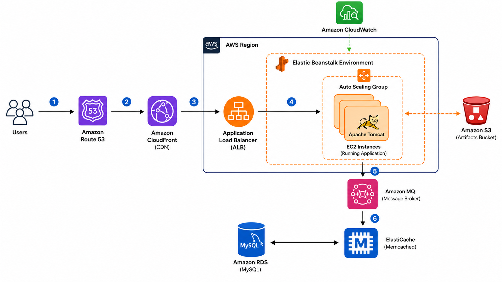

# AWS VProfile Re-Architecture

Deploying the VProfile Java web application on AWS using managed services to build a scalable, highly available, and production-oriented architecture.

---

## 📖 Overview

This project demonstrates the re-architecture of the VProfile application from a traditional VM-based deployment to an AWS managed infrastructure.

The application is deployed using **AWS Elastic Beanstalk**, while leveraging multiple AWS services such as **Application Load Balancer, Auto Scaling, Amazon RDS, Amazon MQ, ElastiCache, Amazon S3, CloudFront, Route 53, and CloudWatch** to improve scalability, availability, and operational efficiency.

---

# 🏗️ Architecture

  

---

## 🚀 Request Flow

1. Users access the application using a custom domain.
2. Amazon Route 53 resolves the domain.
3. Amazon CloudFront serves cached content and forwards requests.
4. Application Load Balancer distributes incoming traffic.
5. Elastic Beanstalk manages EC2 instances through Auto Scaling.
6. The application communicates with:
   - Amazon RDS (MySQL)
   - Amazon MQ
   - Amazon ElastiCache (Memcached)
7. Application artifacts are stored in Amazon S3.
8. Amazon CloudWatch monitors the application and infrastructure.

---

# ☁️ AWS Services Used

| Service | Purpose |
|----------|---------|
| Elastic Beanstalk | Application deployment and environment management |
| EC2 | Runs the Java application |
| Application Load Balancer | Distributes incoming traffic |
| Auto Scaling Group | Automatically scales EC2 instances |
| Amazon RDS (MySQL) | Relational database |
| Amazon MQ | Message broker |
| Amazon ElastiCache | Application caching |
| Amazon S3 | Stores deployment artifacts |
| Amazon CloudFront | Content Delivery Network |
| Amazon Route 53 | DNS Management |
| Amazon CloudWatch | Monitoring and metrics |

---

# 🛠 Deployment Workflow

### Phase 1 – Infrastructure Provisioning

- Login to AWS Account
- Create Key Pair
- Create Security Groups
- Provision Amazon RDS
- Provision Amazon ElastiCache
- Provision Amazon MQ
- Create Elastic Beanstalk Environment
- Configure backend Security Groups

---

### Phase 2 – Application Deployment

- Launch temporary EC2 instance for database initialization
- Import database into Amazon RDS
- Configure Elastic Beanstalk Health Check
- Configure HTTPS Listener on Application Load Balancer
- Build Java application artifact (.war)
- Deploy artifact to Elastic Beanstalk
- Configure CloudFront distribution
- Configure Route 53 DNS records
- Verify application accessibility

---

# 📸 Screenshots

## Elastic Beanstalk

---

## Application Load Balancer

---

## Auto Scaling Group

---

## EC2 Instances

---

## Amazon ElastiCache

---

## Amazon MQ

---

## Running Application

---

# 💡 Key Features

- Elastic Beanstalk managed deployment
- Auto Scaling Group
- Application Load Balancer
- Amazon RDS integration
- Amazon MQ integration
- Amazon ElastiCache integration
- Amazon S3 artifact storage
- CloudFront CDN
- Route 53 DNS management
- CloudWatch monitoring

---

# 📚 Skills Demonstrated

- AWS Elastic Beanstalk
- Amazon EC2
- Application Load Balancer
- Auto Scaling
- Amazon RDS
- Amazon MQ
- Amazon ElastiCache
- Amazon S3
- Amazon CloudFront
- Amazon Route 53
- Amazon CloudWatch
- Linux
- MySQL
- Apache Tomcat
- Java Web Application Deployment

---

# 📌 Lessons Learned

Throughout this project, I gained hands-on experience in:

- Designing a scalable AWS architecture.
- Deploying Java applications using Elastic Beanstalk.
- Configuring networking and security groups.
- Initializing and connecting Amazon RDS.
- Integrating managed services such as Amazon MQ and ElastiCache.
- Using CloudFront and Route 53 for content delivery and DNS management.
- Monitoring infrastructure health with Amazon CloudWatch.

---

## 📄 Project Status

✅ Completed
