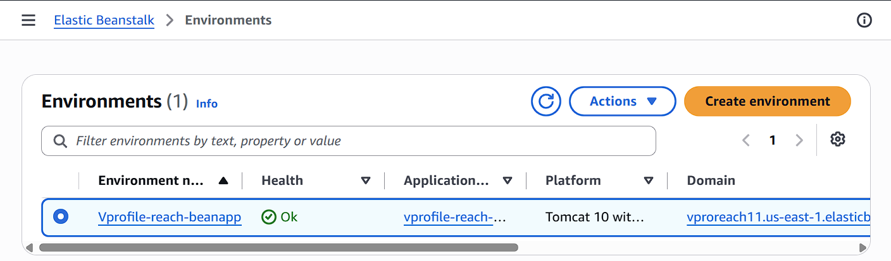
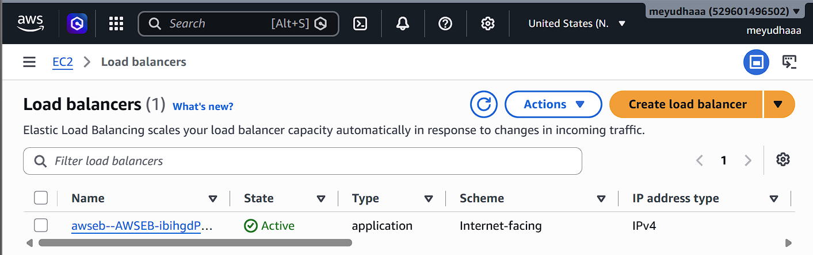
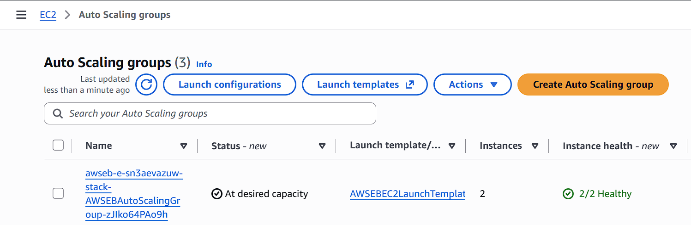
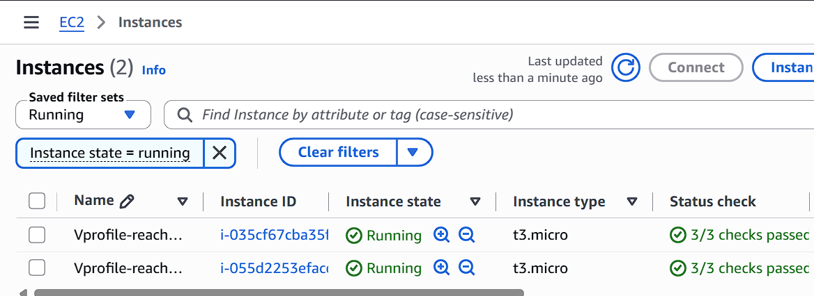
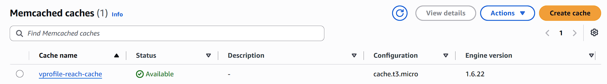
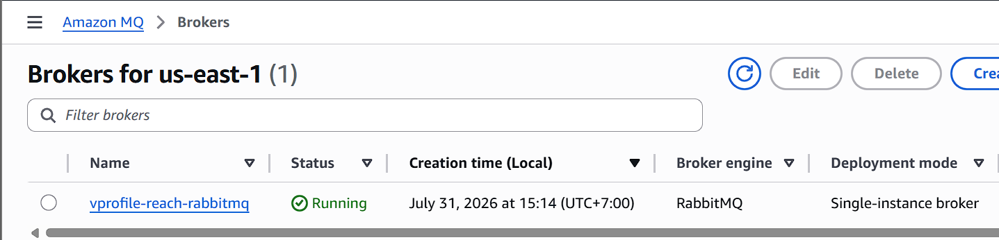

# AWS VProfile Re-Architecture

Deploying the VProfile Java web application on AWS using managed services to build a scalable, highly available, and production-ready architecture.

---

## 📖 Overview

This project demonstrates the deployment and re-architecture of the VProfile Java web application using AWS managed services.

Instead of deploying the application on a single EC2 instance, this project leverages AWS services such as Elastic Beanstalk, Application Load Balancer, Auto Scaling, Amazon RDS, Amazon MQ, ElastiCache, Amazon S3, CloudFront, Route 53, and CloudWatch to improve scalability, availability, and operational efficiency.

---

# 🏗️ Architecture

<p align="center">
    
</p>

---

# 🚀 Architecture Flow

1. Users access the application using a custom domain.
2. Amazon Route 53 resolves the domain name.
3. Amazon CloudFront delivers cached content and forwards requests.
4. Application Load Balancer distributes incoming traffic.
5. AWS Elastic Beanstalk manages the application environment.
6. Auto Scaling Group automatically manages EC2 instances.
7. The application communicates with:
   - Amazon RDS (MySQL)
   - Amazon MQ
   - Amazon ElastiCache (Memcached)
8. Application artifacts are stored in Amazon S3.
9. Amazon CloudWatch monitors the infrastructure and application health.

---

# ☁️ AWS Services Used

| AWS Service | Purpose |
|-------------|---------|
| AWS Elastic Beanstalk | Application deployment and environment management |
| Amazon EC2 | Runs the Java application |
| Application Load Balancer | Distributes incoming traffic |
| Auto Scaling Group | Automatically scales EC2 instances |
| Amazon RDS (MySQL) | Relational database |
| Amazon MQ | Message broker |
| Amazon ElastiCache | Application caching |
| Amazon S3 | Stores deployment artifacts |
| Amazon CloudFront | Content Delivery Network (CDN) |
| Amazon Route 53 | DNS Management |
| Amazon CloudWatch | Monitoring and metrics |

---

# 🛠 Deployment Workflow

## Phase 1 – Infrastructure Provisioning

- Login to AWS Management Console
- Create EC2 Key Pair
- Configure Security Groups
- Create Amazon RDS (MySQL)
- Create Amazon ElastiCache (Memcached)
- Create Amazon MQ Broker
- Create Elastic Beanstalk Environment
- Configure Security Group rules for backend services

---

## Phase 2 – Database Initialization

A temporary EC2 instance was launched to initialize the Amazon RDS database.

### Clone the project repository

```bash
git clone https://github.com/hkhcoder/vprofile-project.git
cd vprofile-project
git checkout awsrefactor
```

### Import SQL backup into Amazon RDS

```bash
mysql -h <RDS-ENDPOINT> \
-u <USERNAME> \
-p accounts < src/main/resources/db_backup.sql
```

### Verify imported tables

```sql
SHOW TABLES;

+--------------------+
| Tables_in_accounts |
+--------------------+
| role               |
| user               |
| user_role          |
+--------------------+
```

The successful import confirms that the required application database schema has been initialized.

---

## Phase 3 – Application Deployment

- Configure Elastic Beanstalk Health Check
- Configure HTTPS Listener on Application Load Balancer
- Build the Java application (.war)
- Deploy the artifact to Elastic Beanstalk
- Store deployment artifact in Amazon S3
- Verify application deployment

---

## Phase 4 – Domain & CDN Configuration

- Configure CloudFront Distribution
- Configure Route 53 Hosted Zone
- Point custom domain to CloudFront
- Verify HTTPS access

---

# 📸 Screenshots

## Elastic Beanstalk Environment



---

## Application Load Balancer



---

## Auto Scaling Group



---

## Amazon EC2 Instances



---

## Amazon ElastiCache



---

## Amazon MQ



---

## Running Application


---

# ✨ Key Features

- Elastic Beanstalk managed deployment
- Highly available application architecture
- Application Load Balancer
- Auto Scaling Group
- Amazon RDS integration
- Amazon MQ integration
- Amazon ElastiCache integration
- Amazon S3 artifact storage
- CloudFront CDN
- Route 53 custom domain
- CloudWatch monitoring

---

# 🧰 Technologies Used

- AWS Elastic Beanstalk
- Amazon EC2
- Application Load Balancer
- Auto Scaling
- Amazon RDS
- Amazon MQ
- Amazon ElastiCache
- Amazon S3
- Amazon CloudFront
- Amazon Route 53
- Amazon CloudWatch
- Linux (Ubuntu)
- Apache Tomcat
- Java
- Maven
- MySQL

---

# 📚 Skills Demonstrated

- Designing scalable AWS architecture
- Deploying Java applications with Elastic Beanstalk
- Managing Auto Scaling Groups
- Configuring Application Load Balancer
- Initializing Amazon RDS databases
- Integrating Amazon MQ and ElastiCache
- Managing DNS with Route 53
- Configuring CloudFront CDN
- Monitoring infrastructure using CloudWatch
- Troubleshooting deployment issues

---

# 🎯 Learning Outcomes

Through this project, I gained hands-on experience in:

- Deploying Java applications using AWS Elastic Beanstalk.
- Understanding the relationship between Elastic Beanstalk, Application Load Balancer, Auto Scaling Group, and EC2 instances.
- Initializing and connecting Amazon RDS databases.
- Integrating managed services such as Amazon MQ and ElastiCache.
- Using CloudFront and Route 53 to deliver applications through a custom domain.
- Monitoring application health using Amazon CloudWatch.
- Building a production-style AWS architecture using managed services.

---

# 📌 Project Status

✅ Completed

---

## 🙏 Acknowledgement

This project is based on the open-source **VProfile** application and was completed as part of a hands-on AWS learning exercise. The focus of this repository is documenting the AWS deployment architecture, configuration process, and lessons learned rather than claiming ownership of the original application source code.
